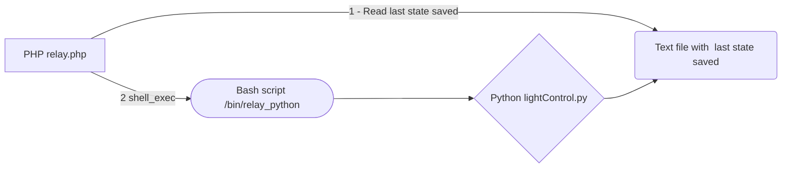

# Raspberry Pi - Relay Control

A PHP web page that interacts with a Python script  to control lamps
from a raspberry pi   

Plugged to an eight-channel relay connected to certain lamps in my house.

## There is 4 files:

- A **PHP** page that call a bash script. A special **sudo** permission was granted to apache user to allow php to call a specific script as root as required on Raspbian to access Pi GPio.
- A **Bash** script to be called by PHP and call the Python to run locally.
- A **Python** script with code that use a GPio library that can control the relay board. 
- A **text** file to save the last state of the switches.

## Connection and setup

This eight-channel relay is connected to some lights at my home, some of then direcly connected, some of them integrated with 3 way switches on the wall, making possible control these light from the web page, but also manually from the regular switches on the walls.
 

## Control the lights from web page 
We can control the lights from these button in relay.php web page. 
We can use this page just clicking in these buttons or we can make a request defining the state of every relay.

#### Example link

http://myDomain.com/relay.php?r1=2&r2=3&r3=3&r4=3&r5=3&r6=3&r7=3&r8=3 
Each parameter is a relay, like r1 means relay 1
Each parameter value is the desired state
- Value **0** make the relay closed (**close**) 
- Value **1** make the relay open (**open**) 
- Value **2** change the state of the relay (**switch**) 
- Value **3** keep the state of the relay (**keep**) 

## Control the lights from Android app
I already use an Android App called **Yatse** to control tv box software called **Kodi** intalled in this raspberry Pi. 
In the Yatse i could add custom bottons that make an HTTP request 
The result is like this:
 
